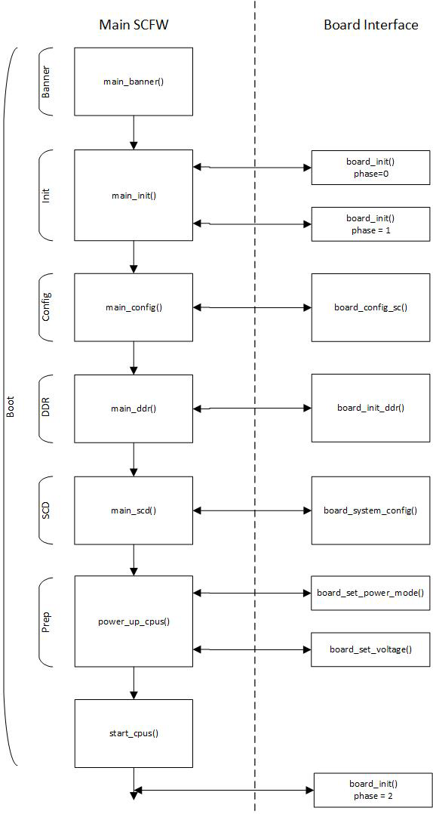
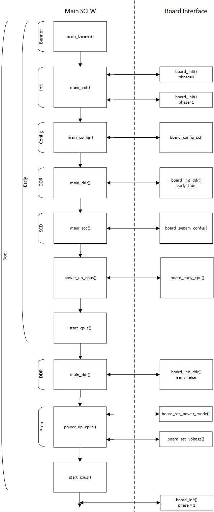

# How to change SCFW

SCFW是怎么编译出来的

SCFW is a binary stored in ${MY_ANDROID}/vendor/nxp/fsl-proprietary/uboot-firmware, built into bootloader. To change SCFW, you need SCFW porting kit and specified board configuration file. SCFW porting kit contains prebuilt binaries and libraries.


## 参考编译步骤

* 《Android_User's_Guide.pdf》
  * 8.12 How to change SCFW


## 参考编译方法

```Console
zengjf@UbuntuServer:scfw_export_mx8qm_b0_1.2$ pwd
/home/zengjf/imx8_p9.0.0_2.1.0_auto_ga/scfw_export_mx8qm_b0_1.2
zengjf@UbuntuServer:scfw_export_mx8qm_b0_1.2$ ls
bin  build_mx8qm_b0  build.sh  cp.sh  Makefile  makefiles  platform
zengjf@UbuntuServer:scfw_export_mx8qm_b0_1.2$ cat build.sh
export TOOLS=/opt
make qm B=mek R=B0 M=1 DL=5 V=0 u=2
cp build_mx8qm_b0/scfw_tcm.bin ../android9.0.0/vendor/nxp/fsl-proprietary/uboot-firmware/imx8q_car/mx8qm-scfw-tcm.bin
cp build_mx8qm_b0/scfw_tcm.bin ../android9.0.0/vendor/nxp/fsl-proprietary/uboot-firmware/imx8q/mx8qm-scfw-tcm.bin
cp build_mx8qm_b0/scfw_tcm.bin ../android9.0.0/vendor/nxp-opensource/imx-mkimage/iMX8QM
```

**注意**：上面`TOOLS`和参考文档不一致是因为Makefile中有修改`CROSS_COMPILE = $(TOOLS)/gcc-arm-none-eabi-*/bin/arm-none-eabi-`


## code 

* 《sc_fw_port.pdf》
  * 3.8 Boot Flow
    * Standard Boot
* scfw_export_mx8qm_b0_1.2_car2/platform/board/mx8qm_mek/board.c


## WorkFlow

Standard | Early
:--:|:--:
 | 

The boot mode is configured using one of the flags in the boot container. Bit 22 of the flags (SC_BD_FLAGS_EARL - Y_CPU_START) must be set for early boot mode. This is done when the image is created using mkimage. The -flags argument passes a flag as a hex value. See Boot Flags for more info.

```
board_init(0)
board_init(1)
board_config_sc()
board_init(4)
board_init_ddr(0)
board_system_config()
board_set_voltage(A53, 1100, 0)
Start PMIC init
Finished  PMIC init

board_set_ldo_voltage test
board_set_power_mode(A53, 0, 0, 3)
board_set_voltage(A72, 1100, 0)
board_set_power_mode(A72, 0, 0, 3)
board_init(5)
board_init(2)
```

## Debug Message

* `make qm B=mek R=B0 M=1 DL=5 V=0 u=2`
  * R: 版本
  * M: 监视器（貌似无效）
  * DL: Debug Level
  * V: verbose output
  * u: uart port
* Makefile
  ```
  # Configure UART
  ifdef u
      U := $(u)
  endif
  ifndef U
      U = 0
  endif
  FLAGS += -DDEBUG_UART=$(U)
  ```
* `platform/board/mx8qm_mek/board.c`
  ```
  #if DEBUG_UART == 3
      /*! Use debugger terminal emulation */
      #define DEBUG_TERM_EMUL
  #endif
  #if DEBUG_UART == 2
      /*! Use alternate debug UART */
      #define ALT_DEBUG_SCU_UART
  #endif
  #if (defined(MONITOR) || defined(EXPORT_MONITOR) || defined(HAS_TEST) \
          || (DEBUG_UART == 1)) && !defined(DEBUG_TERM_EMUL) \
          && !defined(ALT_DEBUG_SCU_UART)
      #define ALT_DEBUG_UART
  #endif
  
  /*! Configure debug UART */
  #ifdef ALT_DEBUG_SCU_UART
      #define LPUART_DEBUG        LPUART_SC
  #else
      #define LPUART_DEBUG        LPUART_M4_0
  #endif
  
  /*! Configure debug UART instance */
  #ifdef ALT_DEBUG_SCU_UART
      #define LPUART_DEBUG_INST   0U
  #else
      #define LPUART_DEBUG_INST   2U
  #endif
  
  #ifdef EMUL
      /*! Configure debug baud rate */
      #define DEBUG_BAUD          4000000U
  #else
      /*! Configure debug baud rate */
      #define DEBUG_BAUD          115200U
  #endif
  ```
  * LPUART_SC
  * 115200
* 打印示例：
  * board_print(3, "board_init_ddr(%d)\n", early);
  * rm_dump(pt_boot);


## 分区

* sc_fw_port.pdf
  * 5.1 Partitions  
    Partitions can be created in several ways. They can be created by default by the SCFW using parameters passed from the ROM (determined by parameters in the boot container), they can be created in the board_system_config() function of the board porting layer of the SCFW, or be created dynamically by calling sc_rm_partition_alloc().
  * Resources represent the IP blocks in the SoC.
  * Pads represent the individual pads of the SoC.
  * Memory regions represent blocks of memory with a start and end address.
* 需要注意的是SCFW中的函数并不是实时的，所以在SCFW中的资源分配可能要到ATF中才能看到效果；
* SCFW souce code
  * platform/board/mx8qm_mek/board.c
    * sc_err_t board_system_config(sc_bool_t early, sc_rm_pt_t pt_boot)
* ATF souce code
  * plat/imx/imx8qm/imx8qm_bl31_setup.c
    * void mx8_partition_resources(void)
      * 获取CPU ID:
        ```
        if (imx_get_cpu_rev(&cpu_id, &cpu_rev) != 0)
            ERROR("Get CPU id and rev failed\n");
        ```
      * sc_rm_set_subsys_rsrc_movable(ipc_handle, SC_R_A72, SC_TRUE);                   // 貌似只能在ATF中分配
      * sc_rm_set_resource_movable(ipc_handle, SC_R_SDHC_0, SC_R_SDHC_0, SC_TRUE);
      * sc_rm_move_all(ipc_handle, secure_part, 3, SC_TRUE, SC_TRUE);

## ATF

* bl31/aarch64/bl31_entrypoint.S
