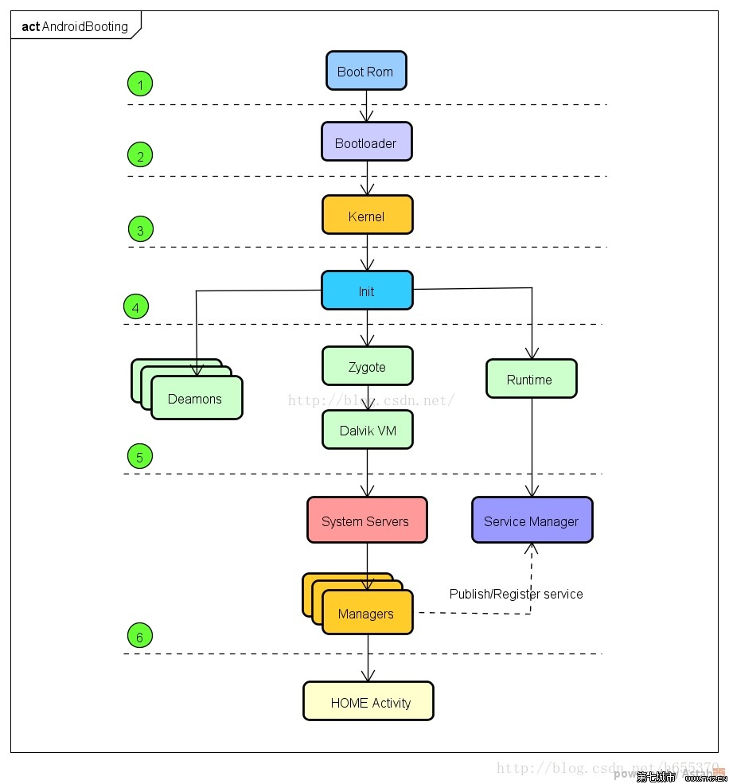
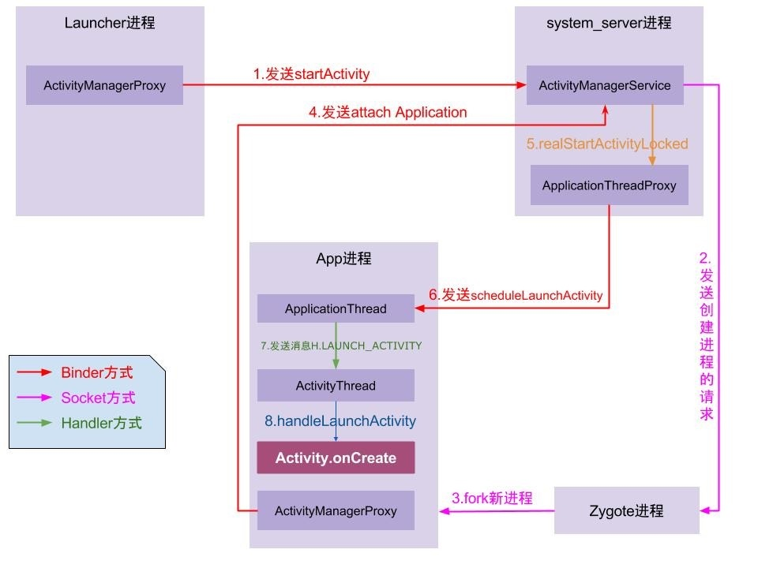
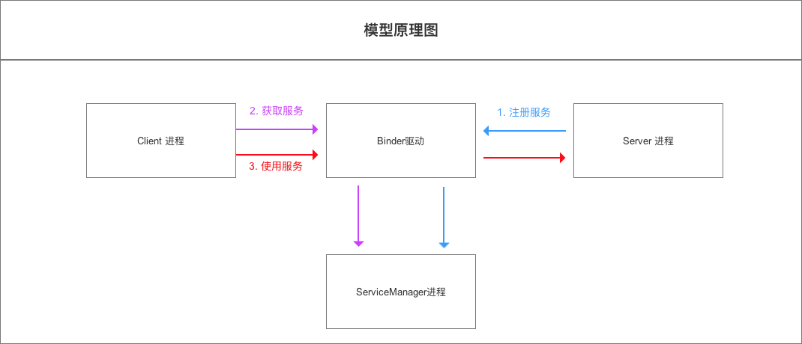

# Framework Principl

## 参考文档

* [Android Framework原理](https://www.jianshu.com/p/2f95ab717078)
* [史上最详细的Android系统SystemUI 启动过程详细解析](https://www.jianshu.com/p/2e0f403e5299)
* [Android系统工程模式启动过程详解](https://blog.csdn.net/foreverJQQ/article/details/71141976)

## Android启动流程



## App启动流程



## SystemServer

SystemServer是Framework中非常重要的一个进程，它是在虚拟机启动后运行的第一个Java进程，SystemServer启动其他系统服务，这些系统服务都是以一个线程的方式存在于SystemServer进程中：

No. | Service | 描述
:--:|:--:|:--
1  | EntropyService | 提供伪随机数
2  | PowerManagerService | 电源管理服务
3  | ActivityManagerService | 最核心的服务之一，管理Activity
4  | TelephonyRegistry | 通过该服务注册电话模块的事件响应，比如重启、关闭、启动等
5  | PackageManagerService | 程序包管理服务
6  | AccountManagerService | 账户管理服务，是指联系人账户，而不是Linux系统的账户 
7  | ContentService ContentProvider | 提供跨进程数据交换
8  | BatteryService | 电池管理服务
9  | LightsService | 自然光强度感应传感器服务
10 | VibratorService | 震动器服务 
11 | AlarmManagerService | 定时器管理服务，提供定时提醒服务
12 | WindowManagerService Framework | 最核心的服务之一，负责窗口管理
13 | BluetoothService | 蓝牙服务
14 | DevicePolicyManagerService | 提供一些系统级别的设置及属性
15 | StatusBarManagerService | 状态栏管理服务
16 | ClipboardService | 系统剪切板服务
17 | InputMethodManagerService | 输入法管理服务
18 | NetStatService | 网络状态服务
19 | NetworkManagementService | 网络管理服务
20 | ConnectivityService | 网络连接管理服务
21 | AccessibilityManagerService | 辅助管理程序截获所有的用户输入，并根据这些输入给用户一些额外的反馈，起到辅助的效果
22 | MountService | 挂载服务，可通过该服务调用Linux层面的mount程序
23 | NotificationManagerService | 通知栏管理服务，Android中的通知栏和状态栏在一起，只是界面上前者在左边，后者在右边
24 | DeviceStorageMonitorService | 磁盘空间状态检测服务
25 | LocationManagerService | 地理位置服务
26 | SearchManagerService | 搜索管理服务
27 | DropBoxManagerService | 通过该服务访问Linux层面的Dropbox程序
28 | WallpaperManagerService | 墙纸管理服务，墙纸不等同于桌面背景，在View系统内部，墙纸可以作为任何窗口的背景 
29 | AudioService | 音频管理服务
30 | BackupManagerService | 系统备份服务
31 | AppWidgetServiceW | idget服务
32 | RecognitionManagerService | 身份识别服务
33 | DiskStatsService | 磁盘统计服务


查看SystemServer启动哪些服务：
* cd frameworks/base/services/java/com/android/server/
  * SystemServer.java
* grep 'traceBeginAndSlog("' * -R | grep '"Start' | grep '");' | sed -e 's/^ *//' | sed -e 's/traceBeginAndSlog("//g' | sed -e 's/");//g'
  ```
  StartServices
  StartInstaller
  StartActivityManager
  StartPowerManager
  StartRecoverySystemService
  StartLightsService
  StartSidekickService
  StartDisplayManager
  StartPackageManagerService
  StartOtaDexOptService
  StartUserManagerService
  StartOverlayManagerService
  StartBatteryService
  StartUsageService
  StartWebViewUpdateService
  StartBinderCallsStatsService
  StartKeyAttestationApplicationIdProviderService
  [...省略]
  ```

## APPLICATION FRAMEWORK

Android的应用程序框架为应用程序层的开发者提供APIs，它实际上是一个应用程序的框架。由于上层的应用程序是以JAVA构建的，因此本层次提供了以下服务：

* 丰富而又可扩展的视图(Views)，可以用来构建应用程序， 它包括列表(lists)，网格(grids)，文本框(text boxes)，按钮(buttons)， 甚至可嵌入的web浏览器；
* 内容提供器(Content Providers)使得应用程序可以访问另一个应用程序的数据(如联系人数据库)，或者共享它们自己的数据；
* 资源管理器(Resource Manager)提供非代码资源的访问，如本地字符串，图形，和布局文件( layout files )；
* 通知管理器 (Notification Manager) 使得应用程序可以在状态栏中显示自定义的提示信息；
* 活动管理器( Activity Manager) 用来管理应用程序生命周期并提供常用的导航回退功能。

## SystemUI 

Android 的 SystemUI 其实就是 Android 的系统界面，它包括了界面上方的状态栏 status bar，下方的导航栏Navigation Bar，锁屏界面 Keyguard ，电源界面 PowerUI，近期任务界面 Recent Task 等等。对于用户而言，SystemUI 的改动是最能直观感受到的。因此，每个 Android 版本在 SystemUI 上都有比较大的改动。而对开发者而言，理解 Android SystemUI 对优化Android系统界面，改善用户体验十分重要。

在 Andorid 系统源码中，package/apps下放的是系统内置的一些 app，例如 settings，camera，Phone，Message 等等。而在 Framework/base/package 下，它们也是系统的 app，SystemUI 就在此目录下。它控制着整个Android系统的界面，但其实他也是一个 app，不同于一般的 app，它不可卸载也不可以被第三方应用替换。

* frameworks/base/packages
  ```
  BackupRestoreConfirmation  ExternalStorageProvider  overlays                    SimAppDialog
  CaptivePortalLogin         ExtServices              PrintRecommendationService  StatementService
  CarrierDefaultApp          ExtShared                PrintSpooler                SystemUI
  CompanionDeviceManager     FakeOemFeatures          services                    VpnDialogs
  CtsShim                    FusedLocation            SettingsLib                 WallpaperBackup
  DefaultContainerService    InputDevices             SettingsProvider            WallpaperCropper
  DocumentsUI                Keyguard                 SharedStorageBackup         WAPPushManager
  EasterEgg                  MtpDocumentsProvider     Shell
  ```
* SystemUI启动
  ```
  * frameworks/base/services/java/com/android/server/SystemServer.java
    * public static void main(String[] args)
      * new SystemServer().run();
        * private void run()
          * startOtherServices();
            * startSystemUi(context, windowManagerF);
  ```

## Binder 

* 参考文档：[Android跨进程通信：图文详解 Binder机制 原理](https://blog.csdn.net/carson_ho/article/details/73560642)  
  
* init.rc：init进程启动ServiceManager进程
  * start servicemanager
