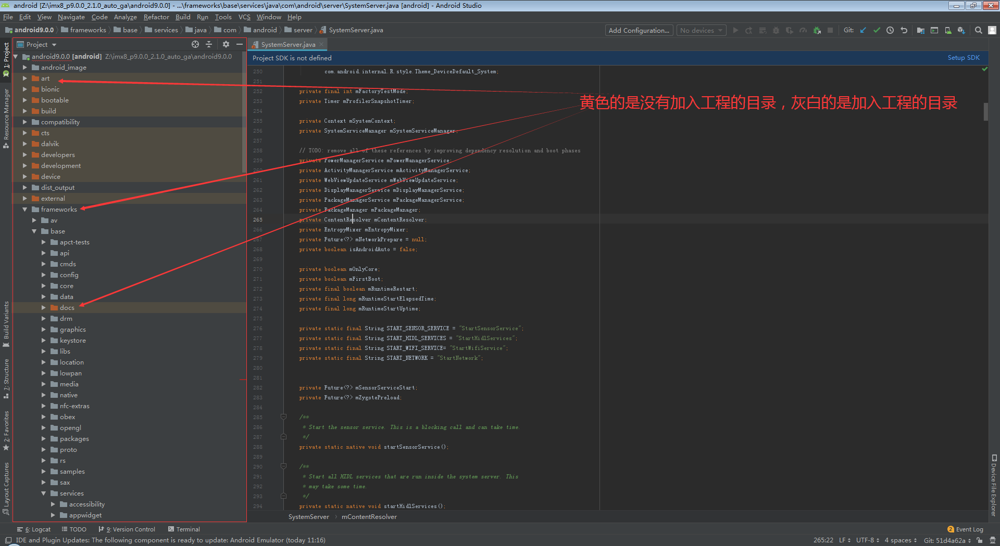

# How To Read Android Source Code

## 参考文档

* [idegen：一个角落里的法器](https://www.jianshu.com/p/8f9b4e4970c9)
* [使用Android Studio查看Android Lollipop源码](https://androidperformance.com/2015/01/16/view-android-source-code-with-androidstudio/)
* [使用 Android Studio 阅读 AOSP 源码](http://geek5nan.github.io/2019/06/23/how-to-reading-AOSP-with-Android-Studio/)

## Steps

* source build/envsetup.sh
* Android P
  * lunch mek_8q_car2-userdebug
  * lunch kvim3-userdebug
* make idegen
* ./development/tools/idegen/idegen.sh
* ls android.*
  ```
  android.iml  android.ipr
  ```
  * android.iml：项目中需要加载的Module配置文件`sourceFolder`、`excludeFolder`加载和忽略加载源代码；
    * vim android.iml
      * 由于默认modules实在太多，先全部禁止：`:%s/<sourceFolder url=/<excludeFolder url=/`
  * android.ipr：项目配置文件；
* 由于加载的module很多，所以需要增大内存：  
  
  * 参考：[大牛们是怎么阅读 Android 系统源码的？ - nothing chen的回答 - 知乎](https://www.zhihu.com/question/19759722/answer/149004731)
  * studio.exe.vmoptions
    ```
    -server
    -Xms768m
    -Xmx768m
    -XX:ReservedCodeCacheSize=240m
    -XX:+UseConcMarkSweepGC
    -XX:SoftRefLRUPolicyMSPerMB=50
    -XX:CICompilerCount=2
    -Dsun.io.useCanonCaches=false
    -Djava.net.preferIPv4Stack=true
    -Djdk.http.auth.tunneling.disabledSchemes=""
    -Djna.nosys=true
    -Djna.boot.library.path=
    
    -da
    ```
  * studio64.exe.vmoptions
    ```
    -Xms1280m
    -Xmx1280m
    -XX:ReservedCodeCacheSize=240m
    -XX:+UseConcMarkSweepGC
    -XX:SoftRefLRUPolicyMSPerMB=50
    -XX:CICompilerCount=2
    -Dsun.io.useCanonCaches=false
    -Djava.net.preferIPv4Stack=true
    -Djdk.http.auth.tunneling.disabledSchemes=""
    -Djna.nosys=true
    -Djna.boot.library.path=
    
    -da
    ```
* 用Android Studio打开ipr文件，即可开始方便阅读Android源代码了，右下角这个地方会等待很久，具体情况跟电脑配置有关：
  

## 优化

AOSP 源码文件较多，Android Studio 默认设置的 1280m 堆最大内存对于 AOSP 这样的大型项目已不再合适，为了更好的性能，向 studio.vmoptions 文件添加一个行，使用语法 -XmxHeapSize 设置最大堆内存。如图所示，笔者将Android Studio 的堆最大内存空间设置为6G。

* android.iml
  ```xml
  [...省略]
    <content url="file://$MODULE_DIR$">
     <sourceFolder url="file://$MODULE_DIR$/vendor/nxp-opensource/fsl_imx_demo/AudioRoute/src" isTestSource="false" />
     <sourceFolder url="file://$MODULE_DIR$/vendor/nxp-opensource/fsl_imx_demo/BleClient/src" isTestSource="false" />
     <sourceFolder url="file://$MODULE_DIR$/vendor/nxp-opensource/fsl_imx_demo/BleServerEmulator/src" isTestSource="false" />
     <sourceFolder url="file://$MODULE_DIR$/vendor/nxp-opensource/fsl_imx_demo/DirectAudioPlayer/java" isTestSource="false" />
     <sourceFolder url="file://$MODULE_DIR$/vendor/nxp-opensource/fsl_imx_demo/Ethernet" isTestSource="false" />
     <sourceFolder url="file://$MODULE_DIR$/vendor/nxp-opensource/fsl_imx_demo/FSLOta/src" isTestSource="false" />
     <sourceFolder url="file://$MODULE_DIR$/vendor/nxp-opensource/fsl_imx_demo/HdmiDualVideo/src" isTestSource="false" />
     <sourceFolder url="file://$MODULE_DIR$/vendor/nxp-opensource/fsl_imx_demo/SleepAwakeAutoTest/src" isTestSource="true" />
     <sourceFolder url="file://$MODULE_DIR$/vendor/nxp-opensource/fsl_imx_demo/Test_DualPlayback/src" isTestSource="true" />
     <sourceFolder url="file://$MODULE_DIR$/vendor/nxp/fsl_imx_omx/CactusPlayer/src" isTestSource="false" />
     <sourceFolder url="file://$MODULE_DIR$/gen" isTestSource="false" generated="true" />
     <excludeFolder url="file://$MODULE_DIR$/.repo" />
     <excludeFolder url="file://$MODULE_DIR$/art" />
     <excludeFolder url="file://$MODULE_DIR$/bionic" />
     <excludeFolder url="file://$MODULE_DIR$/bootable" />
     <excludeFolder url="file://$MODULE_DIR$/build" />
     <excludeFolder url="file://$MODULE_DIR$/cts" />
     <excludeFolder url="file://$MODULE_DIR$/dalvik" />
     <excludeFolder url="file://$MODULE_DIR$/developers" />
     <excludeFolder url="file://$MODULE_DIR$/development" />
     <excludeFolder url="file://$MODULE_DIR$/device" />
     <excludeFolder url="file://$MODULE_DIR$/docs" />
     <excludeFolder url="file://$MODULE_DIR$/external" />
     <excludeFolder url="file://$MODULE_DIR$/frameworks/base/docs" />
     <excludeFolder url="file://$MODULE_DIR$/hardware" />
     <excludeFolder url="file://$MODULE_DIR$/kernel" />
     <excludeFolder url="file://$MODULE_DIR$/libcore" />
     <excludeFolder url="file://$MODULE_DIR$/libnativehelper" />
     <excludeFolder url="file://$MODULE_DIR$/out" />
     <excludeFolder url="file://$MODULE_DIR$/pdk" />
     <excludeFolder url="file://$MODULE_DIR$/platform_testing" />
     <excludeFolder url="file://$MODULE_DIR$/prebuilt" />
     <excludeFolder url="file://$MODULE_DIR$/prebuilts" />
     <excludeFolder url="file://$MODULE_DIR$/sdk" />
     <excludeFolder url="file://$MODULE_DIR$/system" />
     <excludeFolder url="file://$MODULE_DIR$/test" />
     <excludeFolder url="file://$MODULE_DIR$/toolchain" />
     <excludeFolder url="file://$MODULE_DIR$/tools" />
   </content>
  [...省略]
  ```
* 为了加快加载速度，可以将不用的目录禁止掉，这样可以便于分析代码

