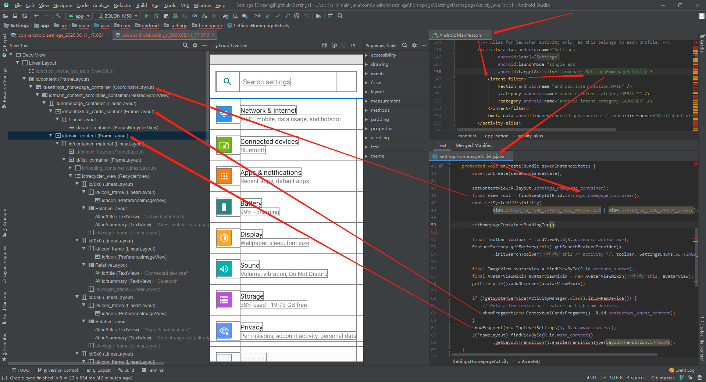

# Settings

Android Settings分析

## 参考文档

* [Android Q WiFi 启动流程分析一](https://blog.csdn.net/panpeng1234/article/details/108078863)

## Layout Inspector使用方法

[Tools] -> [Layout Inspector] -> [Show all processes] -> [com.android.settings] -> [Select Window] -> [com.android.settings.Settings]

## Settings Entry



## TopLevelSettings

TopLevelSettings.java处理信息

```
* packages/apps/Settings/src/com/android/settings/homepage/TopLevelSettings.java
  * public class TopLevelSettings extends DashboardFragment implements PreferenceFragmentCompat.OnPreferenceStartFragmentCallback
    * protected int getPreferenceScreenResId() { return R.xml.top_level_settings; }
      * packages/apps/Settings/res/xml/top_level_settings.xml
```

top_level_settings.xml布局信息如下

```xml
[...省略]
<PreferenceScreen
    xmlns:android="http://schemas.android.com/apk/res/android"
    xmlns:settings="http://schemas.android.com/apk/res-auto"
    android:key="top_level_settings">

    <Preference
        android:key="top_level_network"
        android:title="@string/network_dashboard_title"
        android:summary="@string/summary_placeholder"
        android:icon="@drawable/ic_homepage_network"
        android:order="-120"
        android:fragment="com.android.settings.network.NetworkDashboardFragment"
        settings:controller="com.android.settings.network.TopLevelNetworkEntryPreferenceController"/>

    <Preference
        android:key="top_level_connected_devices"
        android:title="@string/connected_devices_dashboard_title"
        android:summary="@string/summary_placeholder"
        android:icon="@drawable/ic_homepage_connected_device"
        android:order="-110"
        android:fragment="com.android.settings.connecteddevice.ConnectedDeviceDashboardFragment"
        settings:controller="com.android.settings.connecteddevice.TopLevelConnectedDevicesPreferenceController"/>

    <Preference
        android:key="top_level_apps_and_notifs"
        android:title="@string/app_and_notification_dashboard_title"
        android:summary="@string/app_and_notification_dashboard_summary"
        android:icon="@drawable/ic_homepage_apps"
        android:order="-100"
        android:fragment="com.android.settings.applications.AppAndNotificationDashboardFragment"/>

    [...省略]

</PreferenceScreen>
```

可以看到主界面对应布局 top_level_settings.xml中都是一个个Preference，也就对应了主页面每一个条目，可以看到 xml 中 Preference数目和主界面显示数目是不对等了，为啥呢？因为存在动态添加的，查阅 TopLevelSettings 代码发现没啥特殊而且代码量很少，看到 TopLevelSettings 继承 DashboardFragment。主要是因为 DashboardFragment 动态加载

`packages/apps/Settings/src/com/android/settings/dashboard/DashboardFragment.java`

```Java
public abstract class DashboardFragment extends SettingsPreferenceFragment
        implements SettingsBaseActivity.CategoryListener, Indexable,
        SummaryLoader.SummaryConsumer, PreferenceGroup.OnExpandButtonClickListener,
        BasePreferenceController.UiBlockListener {
    
    // ...省略

    @Override
    public void onAttach(Context context) {
        super.onAttach(context);
        mSuppressInjectedTileKeys = Arrays.asList(context.getResources().getStringArray(
                R.array.config_suppress_injected_tile_keys));
        mDashboardFeatureProvider = FeatureFactory.getFactory(context).
                getDashboardFeatureProvider(context);
        final List<AbstractPreferenceController> controllers = new ArrayList<>();
        // Load preference controllers from code
        final List<AbstractPreferenceController> controllersFromCode =
                createPreferenceControllers(context);
        // Load preference controllers from xml definition
        final List<BasePreferenceController> controllersFromXml = PreferenceControllerListHelper
                .getPreferenceControllersFromXml(context, getPreferenceScreenResId());
        // Filter xml-based controllers in case a similar controller is created from code already.
        final List<BasePreferenceController> uniqueControllerFromXml =
                PreferenceControllerListHelper.filterControllers(
                        controllersFromXml, controllersFromCode);

        // Add unique controllers to list.
        if (controllersFromCode != null) {
            controllers.addAll(controllersFromCode);
        }
        controllers.addAll(uniqueControllerFromXml);

        // And wire up with lifecycle.
        final Lifecycle lifecycle = getSettingsLifecycle();
        uniqueControllerFromXml
                .stream()
                .filter(controller -> controller instanceof LifecycleObserver)
                .forEach(
                        controller -> lifecycle.addObserver((LifecycleObserver) controller));

        mPlaceholderPreferenceController =
                new DashboardTilePlaceholderPreferenceController(context);
        controllers.add(mPlaceholderPreferenceController);
        for (AbstractPreferenceController controller : controllers) {
            addPreferenceController(controller);
        }

    // ...省略

}
```

分析`NetworkDashboardFragment`启动Wifi，其中`android:fragment="com.android.settings.wifi.WifiSettings"`即进入Wifi设置界面

```
* com/android/settings/network/NetworkDashboardFragment.java
  * protected int getPreferenceScreenResId()
    * return R.xml.network_and_internet;
      * android:fragment="com.android.settings.wifi.WifiSettings"
        * public void onStart()
          * mWifiEnabler = createWifiEnabler();
            * final SettingsActivity activity = (SettingsActivity) getActivity();
            * return new WifiEnabler(activity, new SwitchBarController(activity.getSwitchBar()), mMetricsFeatureProvider);
              * public class SwitchBarController extends SwitchWidgetController implements SwitchBar.OnSwitchChangeListener
                * public void onSwitchChanged(Switch switchView, boolean isChecked)
                  * mListener.onSwitchToggled(isChecked);
                    * 调用WifiEnabler中的onSwitchToggled()
              * public class WifiEnabler implements SwitchWidgetController.OnSwitchChangeListener
                * public boolean onSwitchToggled(boolean isChecked)
                  * mWifiManager.setWifiEnabled(isChecked)
```

## Wifi设置界面添加网络

在`src/main/java/com/android/settings/wifi/WifiSettings.java`设置界面中，点击添加网络，触发如下事件：

```java
    @Override
    public boolean onPreferenceTreeClick(Preference preference) {
        // If the preference has a fragment set, open that
        if (preference.getFragment() != null) {
            preference.setOnPreferenceClickListener(null);
            return super.onPreferenceTreeClick(preference);
        }

        if (preference instanceof LongPressAccessPointPreference) {
            mSelectedAccessPoint = ((LongPressAccessPointPreference) preference).getAccessPoint();
            if (mSelectedAccessPoint == null) {
                return false;
            }
            if (mSelectedAccessPoint.isActive()) {
                return super.onPreferenceTreeClick(preference);
            }
            /**
             * Bypass dialog and connect to unsecured networks, or previously connected saved
             * networks, or Passpoint provided networks.
             */
            switch (WifiUtils.getConnectingType(mSelectedAccessPoint)) {
                case WifiUtils.CONNECT_TYPE_OSU_PROVISION:
                    mSelectedAccessPoint.startOsuProvisioning(mConnectListener);
                    mClickedConnect = true;
                    break;

                case WifiUtils.CONNECT_TYPE_OPEN_NETWORK:
                    mSelectedAccessPoint.generateOpenNetworkConfig();
                    connect(mSelectedAccessPoint.getConfig(), mSelectedAccessPoint.isSaved());
                    break;

                case WifiUtils.CONNECT_TYPE_SAVED_NETWORK:
                    connect(mSelectedAccessPoint.getConfig(), true /* isSavedNetwork */);
                    break;

                default:
                    showDialog(mSelectedAccessPoint, WifiConfigUiBase.MODE_CONNECT);
                    break;
            }
        } else if (preference == mAddWifiNetworkPreference) {
            onAddNetworkPressed();
        } else {
            return super.onPreferenceTreeClick(preference);
        }
        return true;
    }

    /**
     * Called when "add network" button is pressed.
     */
    private void onAddNetworkPressed() {
        // No exact access point is selected.
        mSelectedAccessPoint = null;
        launchAddNetworkFragment();
    }

    private void launchAddNetworkFragment() {
        new SubSettingLauncher(getContext())
                .setTitleRes(R.string.wifi_add_network)
                .setDestination(AddNetworkFragment.class.getName())
                .setSourceMetricsCategory(getMetricsCategory())
                .setResultListener(this, ADD_NETWORK_REQUEST)
                .launch();
    }
```

## Wifi设置界面连接网络


连接网络UI布局文件：src/main/res/layout/wifi_dialog.xml

```
* src/main/java/com/android/settings/wifi/WifiSettings.java
  * public boolean onPreferenceTreeClick(Preference preference)
    * showDialog(mSelectedAccessPoint, WifiConfigUiBase.MODE_CONNECT);
      * showDialog(WIFI_DIALOG_ID);
        * mDialogFragment = SettingsDialogFragment.newInstance(this, dialogId);
          * settingsDialogFragment.setDialogId(dialogId);
            * mDialogId = dialogId;
          * src/main/java/com/android/settings/SettingsPreferenceFragment.java
            * public Dialog onCreateDialog(Bundle savedInstanceState)
              * return ((DialogCreatable) mParentFragment).onCreateDialog(mDialogId);
                * 调用父类的onCreateDialog()函数，也就是WifiSettings.java中的函数；
        * mDialogFragment.show(getChildFragmentManager(), Integer.toString(dialogId));
```

在`src/main/java/com/android/settings/wifi/WifiSettings.java`设置界面中，点击连接Wifi AP，触发如下事件，最终会调用该类中的`public Dialog onCreateDialog(int dialogId)`：

```Java
    @Override
    public boolean onPreferenceTreeClick(Preference preference) {
        // If the preference has a fragment set, open that
        if (preference.getFragment() != null) {
            preference.setOnPreferenceClickListener(null);
            return super.onPreferenceTreeClick(preference);
        }

        if (preference instanceof LongPressAccessPointPreference) {
            mSelectedAccessPoint = ((LongPressAccessPointPreference) preference).getAccessPoint();
            if (mSelectedAccessPoint == null) {
                return false;
            }
            if (mSelectedAccessPoint.isActive()) {
                return super.onPreferenceTreeClick(preference);
            }
            /**
             * Bypass dialog and connect to unsecured networks, or previously connected saved
             * networks, or Passpoint provided networks.
             */
            switch (WifiUtils.getConnectingType(mSelectedAccessPoint)) {
                case WifiUtils.CONNECT_TYPE_OSU_PROVISION:
                    mSelectedAccessPoint.startOsuProvisioning(mConnectListener);
                    mClickedConnect = true;
                    break;

                case WifiUtils.CONNECT_TYPE_OPEN_NETWORK:
                    mSelectedAccessPoint.generateOpenNetworkConfig();
                    connect(mSelectedAccessPoint.getConfig(), mSelectedAccessPoint.isSaved());
                    break;

                case WifiUtils.CONNECT_TYPE_SAVED_NETWORK:
                    connect(mSelectedAccessPoint.getConfig(), true /* isSavedNetwork */);
                    break;

                default:
                    showDialog(mSelectedAccessPoint, WifiConfigUiBase.MODE_CONNECT);
                    break;
            }
        } else if (preference == mAddWifiNetworkPreference) {
            onAddNetworkPressed();
        } else {
            return super.onPreferenceTreeClick(preference);
        }
        return true;
    }

    private void showDialog(AccessPoint accessPoint, int dialogMode) {
        if (accessPoint != null) {
            WifiConfiguration config = accessPoint.getConfig();
            if (WifiUtils.isNetworkLockedDown(getActivity(), config) && accessPoint.isActive()) {
                RestrictedLockUtils.sendShowAdminSupportDetailsIntent(getActivity(),
                        RestrictedLockUtilsInternal.getDeviceOwner(getActivity()));
                return;
            }
        }

        if (mDialog != null) {
            removeDialog(WIFI_DIALOG_ID);
            mDialog = null;
        }

        // Save the access point and edit mode
        mDlgAccessPoint = accessPoint;
        mDialogMode = dialogMode;

        // 会调用下面的 public Dialog onCreateDialog(int dialogId) 函数
        showDialog(WIFI_DIALOG_ID);
    }

    @Override
    public Dialog onCreateDialog(int dialogId) {
        switch (dialogId) {
            case WIFI_DIALOG_ID:
                // modify network
                if (mDlgAccessPoint == null && mAccessPointSavedState != null) {
                    // restore AP from save state
                    mDlgAccessPoint = new AccessPoint(getActivity(), mAccessPointSavedState);
                    // Reset the saved access point data
                    mAccessPointSavedState = null;
                }
                mDialog = WifiDialog
                        .createModal(getActivity(), this, mDlgAccessPoint, mDialogMode);
                mSelectedAccessPoint = mDlgAccessPoint;
                return mDialog;
        }
        return super.onCreateDialog(dialogId);
    }
```

点击连接网络触发`WifiDialog.WifiDialogListener`回调函数`onSubmit()`，所以这里的`onSubmit()`函数算是其他方面的代码分析起点

```Java
    @Override
    public void onForget(WifiDialog dialog) {
        forget();
    }

    @Override
    public void onSubmit(WifiDialog dialog) {
        if (mDialog != null) {
            submit(mDialog.getController());
        }
    }

    @Override
    public void onScan(WifiDialog dialog, String ssid) {
        // Launch QR code scanner to join a network.
        startActivityForResult(WifiDppUtils.getEnrolleeQrCodeScannerIntent(ssid),
                REQUEST_CODE_WIFI_DPP_ENROLLEE_QR_CODE_SCANNER);
    }

    /* package */ void submit(WifiConfigController configController) {

        final WifiConfiguration config = configController.getConfig();

        if (config == null) {
            if (mSelectedAccessPoint != null
                    && mSelectedAccessPoint.isSaved()) {
                connect(mSelectedAccessPoint.getConfig(), true /* isSavedNetwork */);
            }
        } else if (configController.getMode() == WifiConfigUiBase.MODE_MODIFY) {
            mWifiManager.save(config, mSaveListener);
        } else {
            mWifiManager.save(config, mSaveListener);
            if (mSelectedAccessPoint != null) { // Not an "Add network"
                connect(config, false /* isSavedNetwork */);
            }
        }

        mWifiTracker.resumeScanning();
    }

    /* package */ void forget() {
        mMetricsFeatureProvider.action(getActivity(), SettingsEnums.ACTION_WIFI_FORGET);
        if (!mSelectedAccessPoint.isSaved()) {
            if (mSelectedAccessPoint.getNetworkInfo() != null &&
                    mSelectedAccessPoint.getNetworkInfo().getState() != State.DISCONNECTED) {
                // Network is active but has no network ID - must be ephemeral.
                mWifiManager.disableEphemeralNetwork(
                        AccessPoint.convertToQuotedString(mSelectedAccessPoint.getSsidStr()));
            } else {
                // Should not happen, but a monkey seems to trigger it
                Log.e(TAG, "Failed to forget invalid network " + mSelectedAccessPoint.getConfig());
                return;
            }
        } else if (mSelectedAccessPoint.getConfig().isPasspoint()) {
            try {
                mWifiManager.removePasspointConfiguration(mSelectedAccessPoint.getConfig().FQDN);
            } catch (IllegalArgumentException e) {
                Log.e(TAG, "Failed to remove Passpoint configuration with error: " + e);
                return;
            }
        } else {
            mWifiManager.forget(mSelectedAccessPoint.getConfig().networkId, mForgetListener);
        }

        mWifiTracker.resumeScanning();

        // We need to rename/replace "Next" button in wifi setup context.
        changeNextButtonState(false);
    }

    protected void connect(final WifiConfiguration config, boolean isSavedNetwork) {
        // Log subtype if configuration is a saved network.
        mMetricsFeatureProvider.action(getContext(), SettingsEnums.ACTION_WIFI_CONNECT,
                isSavedNetwork);
        mWifiManager.connect(config, mConnectListener);
        mClickedConnect = true;
    }

    protected void connect(final int networkId, boolean isSavedNetwork) {
        // Log subtype if configuration is a saved network.
        mMetricsFeatureProvider.action(getActivity(), SettingsEnums.ACTION_WIFI_CONNECT,
                isSavedNetwork);
        mWifiManager.connect(networkId, mConnectListener);
    }
```
